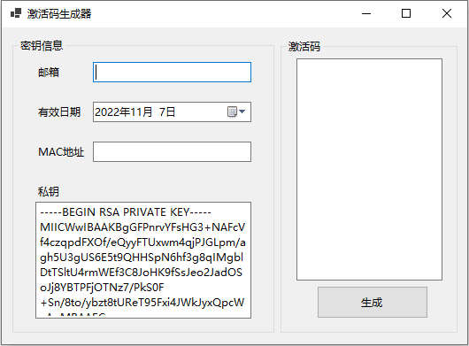
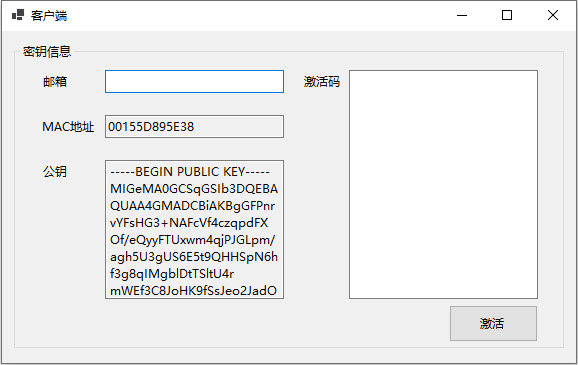

LicenseGenerator
===

一个基于RSA算法的，用于软件授权license(注册、激活码)生成和验证，并提供了生成器和客户端的GUI的简易demo。主要为了记录学习内容，仅供参考。

原理
===

基于RSA非对称加密算法，先通过私钥为授权信息签名，再将授权信息与签名组合为激活码发放到用户手中。客户端会先将激活码解码，并验证授权信息与签名是否匹配，且判断授权信息是否与用户信息相吻合，若皆能通过验证则予以软件授权。

详情见博客文章 [基于RSA算法的软件授权生成和验证 - 余弦G的博客](https://www.cosineg.com/archives/114/)

截图
===

